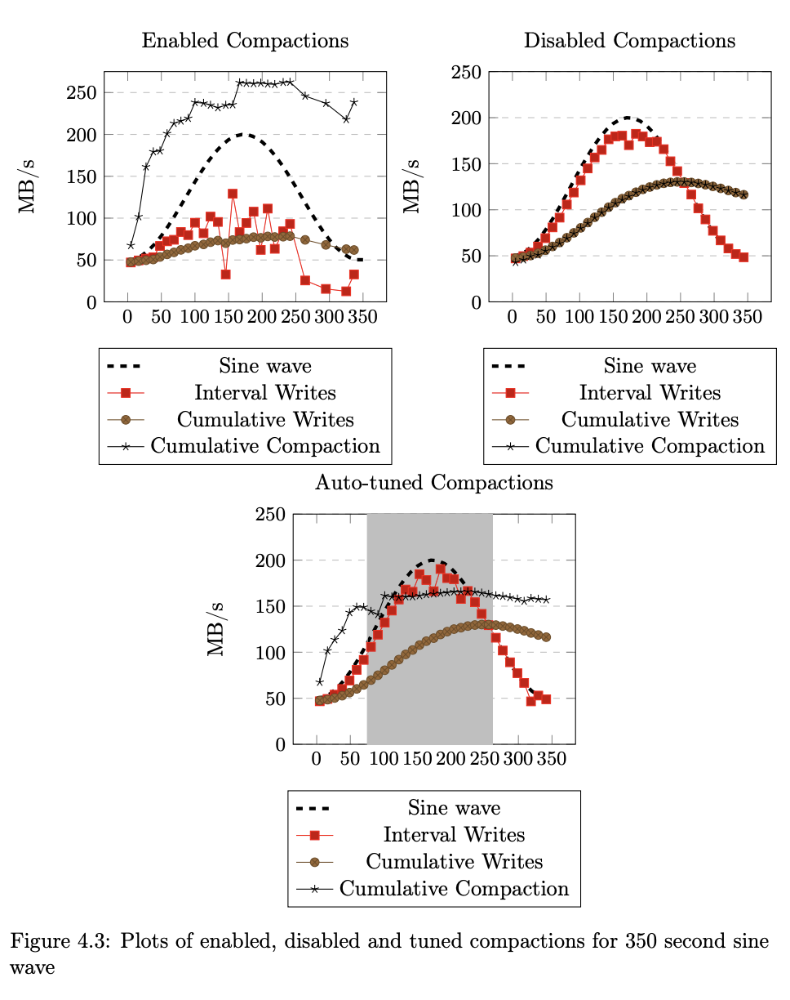

# rocksdb-statistics

A small snippet I wrote to generate plots for my thesis on [Auto-tuning RocksDB](https://ntnuopen.ntnu.no/ntnu-xmlui/bitstream/handle/11250/2506148/19718_FULLTEXT.pdf)

Parses db_bench.log files outputted from RocksDB
Outputs CSV-files and pgfplot of write, compaction and stall statistics.

#### Supported statistics:

- interval_writes
- cumulative_writes
- interval_stall
- cumulative_stall
- interval_compaction
- cumulative_compaction

## Usage

`pip install rocksdb-statistics`

`rocksdb-statistics db_bench.log`

Parsed stats are outputted to `output/` in the current directory

Alternatively specify what stats to output
`rocksdb-statistics db_bench.log --statistics "interval_writes,interval_compaction"`

## Example

Run db_bench with statistics using `stats_interval_seconds` to retrieve stats for each second. Make sure to set `stats_per_interval` to make db_bench output `** DB stats **` for each interval.

`./db_bench --benchmarks="fillrandom,stats" -stats_interval_seconds 1 -stats_per_interval 1 &> db_bench.log`
`rocksdb-statistics db_bench.log`

The directory `output/` contains the parsed statistics in csv.
Example files are provided in the `example/` directory.

You can also add `-statistics` to get a summary of a lot of other things.
`./db_bench --benchmarks="fillrandom,stats" -statistics -stats_interval_seconds 1 -stats_per_interval 1 &> db_bench.log`

## Example plots

Below are some plots I generated using this tool for my thesis.

